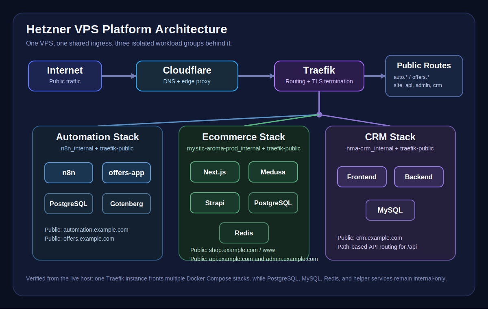

# Hetzner VPS Infrastructure

This is a real server. The repo is a cleaned public version of the actual setup - credentials swapped for env vars, personal mounts removed, Traefik flags converted to YAML. The architecture, routing model, and operational decisions are all live.

This server is not a single-app box. It is a compact production host that fronts several independent workloads through one Traefik edge proxy, isolates internal traffic with Docker networks, and uses Cloudflare for DNS and edge routing.

The live host currently runs three main workload groups:

- automation: `n8n`, PostgreSQL, Gotenberg, and a  offers service for Natural Mystic Aroma
- ecommerce shop for Natural Mystic Aroma: Next.js storefront, Medusa API, Strapi admin, PostgreSQL, Redis
- CRM for Natural Mystic Aroma: frontend, backend, MySQL

## What This Project Demonstrates

- designing a multi-service Docker platform on a single VPS
- exposing multiple domains and subdomains through one Traefik ingress layer
- isolating east/west traffic with per-stack internal networks
- keeping databases off the public edge
- combining Cloudflare at the DNS layer with container-aware origin routing
- documenting real operational trade-offs instead of publishing a cleaned-up fiction
- operating a practical production setup without overengineering it into Kubernetes

## Diagram



## Host Snapshot

- Provider: Hetzner
- Plan: CX33
- Region: Helsinki
- Virtualization: KVM
- OS: Ubuntu 24.04.4 LTS
- Role: multi-stack Docker host with shared ingress

## Platform Overview

At the top level, the host follows one clear pattern:

- Cloudflare handles DNS and edge routing
- Traefik handles origin-side routing and TLS termination
- each application group has its own internal Docker network
- only public-facing services join the shared `traefik-public` network
- databases and internal helpers stay private

*One edge note: the live host uses Traefik's TLS challenge for ACME, not Cloudflare's DNS challenge. Cloudflare sits in front for DNS and proxying, but origin certificates are handled directly by Traefik. It works, and a DNS challenge migration is a documented next step.*


## Workload Groups

### 1. Automation Stack

This stack powers workflow automation and document-related helper flows.

**Services:**

- `n8n`
- `postgres`
- `gotenberg`
- `offers-app`

**Public entrypoints:**

- `automation.example.com` -> `n8n`
- `offers.example.com` -> `offers-app`

**Network:** `n8n_internal` `traefik-public`

**Why it's wired this way:**

- `n8n` needs both internal database access and public webhook/editor access
- `offers-app` is public, but also needs internal access to `gotenberg`
- `postgres` and `gotenberg` stay off the public edge entirely

### 2. Ecommerce Stack

This stack supports the public website and backend commerce services.

**Services:**

- Next.js storefront
- Medusa backend
- Strapi admin
- PostgreSQL
- Redis

**Public entrypoints:**

- `shop.example.com` and `www.shop.example.com` -> Next.js
- `api.example.com` -> Medusa
- `admin.example.com` -> Strapi

**Network:** : `mystic-aroma-prod_internal` `traefik-public`

**Why it's wired this way:**

- the storefront, API, and admin are public through Traefik
- PostgreSQL and Redis are internal-only
- application traffic stays grouped per project instead of sharing one flat Docker network with unrelated services

### 3. CRM Stack

This stack separates the user-facing CRM app from its API and data store.

Components verified on the host:

- CRM frontend
- CRM backend
- MySQL

**Public entrypoints:**

- `crm.example.com` -> frontend
- `crm.example.com/api` -> backend

**Network:**: `nma-crm_internal` `traefik-public`

**Why it's wired this way:**

- the frontend and backend are exposed with separate Traefik routers
- the backend remains internally connected to MySQL only
- MySQL is not published to the host and does not join the public edge network

For a more explicit service-by-service map, see [`docs/services.md`](./docs/services.md).

## Architecture

```text
Internet
   │
Cloudflare (DNS + proxy)
   │
Traefik (reverse proxy + SSL termination)
   ├── automation.example.com -> n8n
   ├── offers.example.com -> offers-app
   ├── shop.example.com -> Next.js storefront
   ├── api.example.com -> Medusa API
   ├── admin.example.com -> Strapi admin
   └── crm.example.com -> CRM frontend / CRM backend

Private networks behind the edge:
   ├── n8n_internal
   │   ├── n8n
   │   ├── PostgreSQL
   │   └── Gotenberg
   ├── mystic-aroma-prod_internal
   │   ├── Next.js
   │   ├── Medusa
   │   ├── Strapi
   │   ├── PostgreSQL
   │   └── Redis
   └── nma-crm_internal
       ├── CRM frontend
       ├── CRM backend
       └── MySQL
```

## Why Traefik

Traefik is the right choice here because the host is running multiple independent Docker Compose projects that still need one coherent ingress layer.

- routing is defined next to each service through Docker labels
- new public services can be added without manually editing and reloading a central Nginx config
- TLS handling stays inside the reverse proxy layer
- one shared edge network can front several application groups cleanly

Nginx would also work, but Traefik is a better fit for a VPS where services are started, updated, and routed directly from Compose-managed containers.

## Why the Network Layout Matters

The network design is one of the strongest parts of this server. Four networks, clear boundaries:

- `traefik-public`
- `n8n_internal`
- `mystic-aroma-prod_internal`
- `nma-crm_internal`

This matters because:

- public services join the edge network only when they need to answer HTTP traffic
- databases and private helpers stay internal
- unrelated stacks do not share one flat internal network

On a single VPS, this is a practical way to reduce accidental exposure without adding orchestration complexity.

## SSL Flow

The host uses Traefik's ACME `tlsChallenge` for certificate issuance and renewal.

**The request path:**

- a hostname is managed in Cloudflare DNS
- Cloudflare routes traffic to the VPS
- Traefik receives the request on :443 and terminates TLS
- Traefik forwards the request to the correct container over Docker networking
- ACME certificate data is persisted in acme.json

One thing worth noting: the live host is not using Cloudflare's DNS challenge for certificate issuance. Cloudflare sits in front for DNS and proxying, but origin certificates are handled directly by Traefik via TLS challenge. It works cleanly - and migrating to DNS challenge is a documented next step if fully proxied certificate issuance becomes the standard approach.

## Cloudflare Setup

Cloudflare is used here for:

- DNS management across domains and subdomains
- edge routing before traffic reaches the VPS
- keeping hostname management centralized while Traefik handles origin-side service routing

This is a clean split of responsibilities: Cloudflare decides how traffic reaches the server, Traefik decides which container receives it.

## Security Notes

From the live audit:

- `PermitRootLogin no` is set in SSH configuration
- UFW is enabled and active
- no SSH drop-in overrides were present in `/etc/ssh/sshd_config.d/`
- `fail2ban` was not installed on the inspected host

That last point is documented intentionally. A useful portfolio repo should show what is real, including the gaps.

More detail is documented in [`docs/server-hardening.md`](./docs/server-hardening.md).

## Repository Structure

The included Compose file is a representative slice of the platform, not a complete public reproduction of every production stack described in this case study.

```text
.
├── README.md
├── docker-compose.yml
├── .env.example
├── LICENSE
├── assets/
│   └── architecture-diagram.svg
├── docs/
│   ├── decisions.md
│   ├── operations.md
│   ├── server-hardening.md
│   └── services.md
└── traefik/
    ├── dynamic.yml
    └── traefik.yml
```

## NEXTSTEPS

- install OpenClaw
- set up fail2ban

## Contact

lukasz@kedzielawski.com
